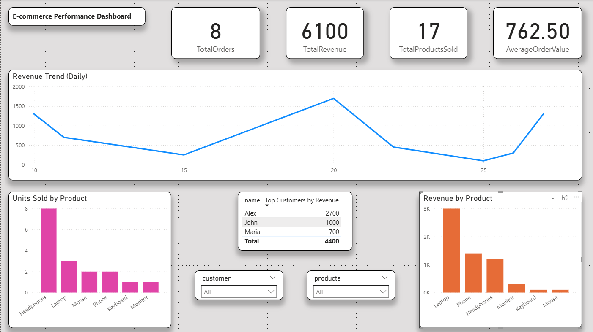

# 📊 E-commerce Analytics Dashboard (SQL + Power BI)

## 📌 Overview

This project simulates a real-world e-commerce business scenario and demonstrates how raw transactional data can be transformed into actionable business insights using SQL and Power BI.

The analysis focuses on **sales performance, customer behavior, and product trends**, with the goal of supporting data-driven decision-making.

---

## 🎯 Business Objectives

* Analyze overall revenue and sales performance
* Identify top-performing products and revenue drivers
* Understand customer purchasing behavior
* Track revenue trends over time
* Detect opportunities for growth and optimization

---

## 🛠️ Tools & Technologies

* **SQL** – Data modeling, querying, and transformation
* **Power BI** – Dashboard design and data visualization

---

## 🧱 Data Model

The database is designed using a relational structure:

* `customers` → customer information
* `orders` → transaction-level data
* `order_items` → product-level transaction details (fact table)
* `products` → product catalog and pricing

### Relationships:

* One customer → many orders
* One order → many order items
* One product → many order items

This structure enables flexible analysis of **revenue, product performance, and customer activity**.

---

## 📊 Key Metrics

* **Total Orders** → Number of completed transactions
* **Total Revenue** → Total sales value (`quantity × price`)
* **Total Products Sold** → Total units sold
* **Average Order Value (AOV)** → Revenue per order

---

## 📈 Dashboard Features

* KPI cards for quick performance overview
* Daily revenue trend to identify patterns and fluctuations
* Units sold by product to track demand
* Revenue by product to evaluate performance
* Top customers by total revenue
* Interactive slicers (customer and product filters)

---

## 🖼️ Dashboard Preview

---

## 📊 Key Business Insights

* **Revenue concentration:** A small number of customers generate a large portion of total revenue, highlighting opportunities for targeted retention strategies

* **Product performance:** High-volume products (e.g., headphones) drive unit sales, while higher-priced products (e.g., laptops) contribute significantly to overall revenue

* **Customer engagement gap:** Some customers have no recorded purchases, indicating potential onboarding or retention issues

* **Revenue variability:** Sales fluctuate across days, suggesting inconsistent purchasing patterns and opportunities for better promotional timing

---

## 💼 Business Recommendations

* Focus retention efforts on **high-value customers** to maximize lifetime value
* Bundle high-volume products with premium items to increase average order value
* Re-engage inactive customers through targeted campaigns
* Introduce promotions during low-revenue periods to stabilize sales

---

## 🧩 Business Use Case

This dashboard can be used by business stakeholders to:

* Monitor daily sales performance
* Identify top customers and key revenue drivers
* Track product demand and profitability
* Support decisions related to marketing, inventory, and customer retention

---

## 🧠 Key Skills Demonstrated

* Designed a relational database schema optimized for analysis
* Wrote multi-table SQL queries to calculate revenue and customer metrics
* Applied aggregations, joins, and window functions for data transformation
* Built an interactive Power BI dashboard with KPIs and filtering
* Translated data into actionable business insights and recommendations

---

## ✅ Data Validation

All key metrics (Total Revenue, Total Orders, AOV) were validated using SQL queries to ensure consistency and accuracy with Power BI visualizations.

---

## 🚀 Future Improvements

* Implement customer segmentation (high vs low value customers)
* Expand dataset to include multiple months for deeper trend analysis
* Add product categories for more granular insights
* Introduce time-based analysis (monthly trends, growth rates)

---

## 👤 Author

**Ernesto Villa**
Aspiring Data Analyst focused on SQL, Power BI, and data-driven decision-making
